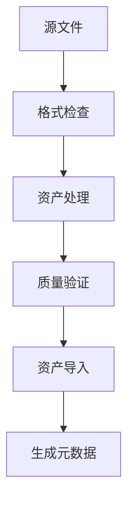
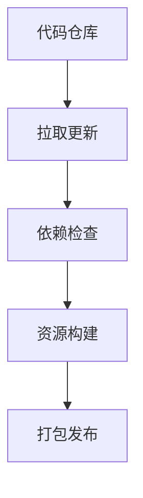

 # 数字人工具链文档

## 工具链目标
- 建立完整的数字人制作流程
- 提供高效的工具集成方案
- 确保工具间数据流转
- 支持自动化处理流程

## 工具链架构

### 1. 工具链结构
```
ToolChain
├── ContentCreation
│   ├── ModelingTools
│   ├── TexturingTools
│   └── AnimationTools
├── AssetProcessing
│   ├── AssetConverter
│   ├── BatchProcessor
│   └── QualityChecker
├── RuntimeTools
│   ├── PerformanceMonitor
│   ├── DebugVisualizer
│   └── ProfilerTools
└── PipelineTools
    ├── BuildSystem
    ├── VersionControl
    └── AssetManagement
```

### 2. 工具分类

#### 内容创作工具
```json
{
    "modeling": {
        "primary": "Maya/3ds Max",
        "secondary": "ZBrush/Blender",
        "format": "FBX/OBJ"
    },
    "texturing": {
        "primary": "Substance Painter",
        "secondary": "Mari/Photoshop",
        "format": "PSD/TIFF"
    },
    "animation": {
        "primary": "MotionBuilder",
        "secondary": "Maya",
        "format": "FBX/BVH"
    }
}
```

#### 资产处理工具
```python
# 资产处理流程
class AssetProcessor:
    def process_model():
        # 模型优化
        optimize_topology()
        generate_lods()
        check_uvs()
        
    def process_texture():
        # 贴图处理
        compress_textures()
        generate_mipmaps()
        convert_formats()
        
    def process_animation():
        # 动画处理
        optimize_curves()
        reduce_keyframes()
        verify_skeleton()
```

## 工具功能

### 1. 模型处理工具
#### 功能列表
- 模型检查
- LOD生成
- UV优化
- 骨骼处理

#### 使用示例
```python
# 模型处理示例
def process_model(model_path):
    # 加载模型
    model = load_model(model_path)
    
    # 检查拓扑
    check_topology(model)
    
    # 生成LOD
    generate_lods(model, levels=[0.75, 0.5, 0.25])
    
    # 优化UV
    optimize_uvs(model)
    
    # 导出
    export_model(model, output_path)
```

### 2. 贴图处理工具
#### 功能列表
- 格式转换
- 压缩处理
- 批量处理
- 质量检查

#### 使用示例
```python
# 贴图处理示例
def process_texture(texture_path):
    # 加载贴图
    texture = load_texture(texture_path)
    
    # 转换格式
    convert_format(texture, format="BC7")
    
    # 生成mipmap
    generate_mipmaps(texture)
    
    # 压缩
    compress_texture(texture)
```

### 3. 动画处理工具
#### 功能列表
- 动画优化
- 动作重定向
- 曲线编辑
- 批量处理

#### 使用示例
```python
# 动画处理示例
def process_animation(anim_path):
    # 加载动画
    animation = load_animation(anim_path)
    
    # 优化关键帧
    optimize_keyframes(animation)
    
    # 平滑曲线
    smooth_curves(animation)
    
    # 重定向
    retarget_animation(animation, target_skeleton)
```

## 自动化流程

### 1. 资产导入流程


### 2. 构建流程


## 工具配置

### 1. 环境配置
```json
{
    "tools": {
        "maya": "C:/Program Files/Autodesk/Maya2024",
        "substance": "C:/Program Files/Adobe/Substance",
        "blender": "C:/Program Files/Blender"
    },
    "plugins": {
        "maya_plugins": ["modelChecker", "uvTools"],
        "substance_plugins": ["batchProcessor"]
    }
}
```

### 2. 处理配置
```json
{
    "model": {
        "max_triangles": 100000,
        "lod_levels": [1.0, 0.75, 0.5, 0.25],
        "uv_margin": 0.001
    },
    "texture": {
        "max_size": 4096,
        "format": "BC7",
        "mipmap_levels": "auto"
    }
}
```

## 工具开发

### 1. 插件系统
```python
# 插件接口
class ToolPlugin:
    def initialize():
        pass
        
    def process():
        pass
        
    def cleanup():
        pass
```

### 2. 扩展开发
- 自定义处理节点
- 工具链扩展
- 新功能集成
- API开发

## 调试功能

### 1. 日志系统
```python
# 日志配置
class LogSystem:
    def log_info(message):
        pass
        
    def log_warning(message):
        pass
        
    def log_error(message):
        pass
```

### 2. 错误处理
- 错误捕获
- 问题诊断
- 修复建议
- 日志追踪

## 最佳实践

### 1. 工作流程
- 遵循命名规范
- 使用版本控制
- 执行质量检查
- 保持文档更新

### 2. 性能考虑
- 批量处理优化
- 并行处理
- 缓存管理
- 资源复用

## 参考资源
1. [Digital Content Creation](https://www.autodesk.com/solutions/digital-content-creation)
2. [Asset Pipeline](https://docs.unrealengine.com/en-US/Pipeline)
3. [Tool Development](https://developer.blender.org/)

## 更新记录
| 日期 | 版本 | 更新内容 | 更新人 |
|------|------|----------|--------|
| 2025-04-19 | v0.1 | 初始版本 | TA |