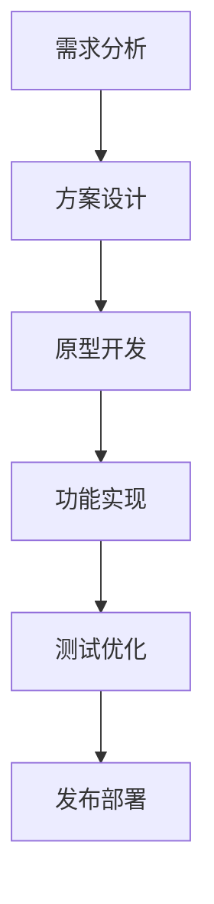

# 数字人项目管理文档

## 项目目标
- 建立高效的项目管理流程
- 确保项目质量和进度
- 优化资源分配和使用
- 提高团队协作效率

## 项目架构

### 1. 组织结构
```
ProjectTeam
├── ProjectManagement
│   ├── ProjectManager
│   ├── TechnicalLead
│   └── ArtLead
├── TechnicalTeam
│   ├── EngineDevelopment
│   ├── ToolsDevelopment
│   └── TechnicalArtist
├── ArtTeam
│   ├── Modeling
│   ├── Texturing
│   └── Animation
└── QATeam
    ├── QualityControl
    ├── Testing
    └── Optimization
```

### 2. 职责分工

#### 项目管理
```json
{
    "ProjectManager": {
        "responsibilities": [
            "项目规划与监控",
            "资源调配",
            "风险管理",
            "进度跟踪"
        ]
    },
    "TechnicalLead": {
        "responsibilities": [
            "技术方案制定",
            "技术难点攻关",
            "性能优化",
            "技术文档审核"
        ]
    },
    "ArtLead": {
        "responsibilities": [
            "美术风格把控",
            "资产质量管理",
            "制作流程优化",
            "美术文档审核"
        ]
    }
}
```

## 项目流程

### 1. 开发流程


### 2. 迭代周期
```
Sprint周期: 2周
- 周一: Sprint计划会议
- 每日: 站会
- 周五: 周报总结
- 双周末: Sprint回顾会议
```

## 质量管理

### 1. 质量标准
#### 技术标准
- 代码规范
- 性能指标
- 安全要求
- 兼容性要求

#### 美术标准
- 模型质量
- 贴图规范
- 动画标准
- 特效要求

### 2. 检查流程
```python
# 质量检查流程
class QualityCheck:
    def check_code():
        # 代码审查
        run_code_review()
        check_performance()
        verify_security()
        
    def check_art():
        # 美术审查
        check_model_quality()
        verify_textures()
        review_animations()
```

## 风险管理

### 1. 风险识别
- 技术风险
- 进度风险
- 质量风险
- 资源风险

### 2. 应对策略
```json
{
    "technical_risk": {
        "prevention": [
            "技术预研",
            "原型验证",
            "备选方案"
        ],
        "response": [
            "技术攻关",
            "专家咨询",
            "方案调整"
        ]
    },
    "schedule_risk": {
        "prevention": [
            "合理规划",
            "进度缓冲",
            "资源储备"
        ],
        "response": [
            "加班处理",
            "调整范围",
            "增加资源"
        ]
    }
}
```

## 进度管理

### 1. 里程碑计划
```
Phase 1: 原型验证 (1个月)
- 技术验证
- 效果验证
- 性能验证

Phase 2: 核心功能 (2个月)
- 基础功能
- 核心特性
- 基础优化

Phase 3: 功能完善 (2个月)
- 功能扩展
- 性能优化
- 问题修复

Phase 4: 测试发布 (1个月)
- 全面测试
- 问题修复
- 发布准备
```

### 2. 任务追踪
```sql
-- 任务状态跟踪
CREATE TABLE Tasks (
    id INT PRIMARY KEY,
    name VARCHAR(100),
    status ENUM('待处理', '进行中', '已完成', '已验证'),
    priority ENUM('高', '中', '低'),
    assignee VARCHAR(50),
    deadline DATE
);
```

## 资源管理

### 1. 人力资源
#### 团队配置
```
角色        | 人数 | 工作内容
-----------|------|----------
项目经理   | 1    | 项目管理
技术主管   | 1    | 技术领导
美术主管   | 1    | 美术领导
开发工程师 | 4    | 功能开发
技术美术   | 2    | 技术支持
美术人员   | 4    | 资产制作
测试人员   | 2    | 质量保证
```

### 2. 设备资源
```json
{
    "development": {
        "workstations": 10,
        "test_devices": 5,
        "servers": 2
    },
    "software": {
        "development_tools": ["VS Code", "Unity", "UE"],
        "art_tools": ["Maya", "ZBrush", "Substance"],
        "management_tools": ["Jira", "Git", "Jenkins"]
    }
}
```

## 文档管理

### 1. 文档结构
```
Documentation
├── ProjectDocs
│   ├── ProjectPlan
│   ├── DesignDocs
│   └── TechnicalDocs
├── WorkingDocs
│   ├── Guidelines
│   ├── Standards
│   └── Workflows
└── ReportDocs
    ├── StatusReports
    ├── TestReports
    └── ReviewDocs
```

### 2. 版本控制
```bash
# 文档版本控制
docs/
  ├── v1.0/
  │   ├── design/
  │   └── specs/
  ├── v1.1/
  │   ├── design/
  │   └── specs/
  └── current/
      ├── design/
      └── specs/
```

## 沟通管理

### 1. 会议制度
- 每日站会 (15分钟)
- 周进度会 (1小时)
- 月度总结会 (2小时)
- 技术评审会 (根据需要)

### 2. 报告制度
```python
# 报告类型
class Reports:
    def daily_report():
        # 日报内容
        report_progress()
        report_issues()
        plan_next_day()
        
    def weekly_report():
        # 周报内容
        summarize_progress()
        analyze_issues()
        plan_next_week()
```

## 最佳实践

### 1. 项目管理
- 明确目标和范围
- 合理分配资源
- 及时识别风险
- 保持有效沟通

### 2. 团队协作
- 促进知识共享
- 鼓励创新思维
- 建立信任关系
- 重视团队建设

## 参考资源
1. [Project Management Institute](https://www.pmi.org/)
2. [Agile Project Management](https://www.atlassian.com/agile)
3. [Digital Project Management](https://www.projectmanagement.com/digital)

## 更新记录
| 日期 | 版本 | 更新内容 | 更新人 |
|------|------|----------|--------|
| 2025-04-19 | v0.1 | 初始版本 | PM | 